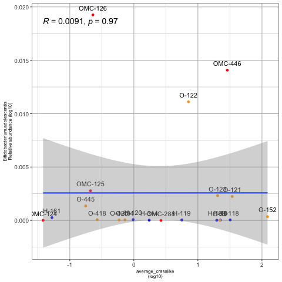
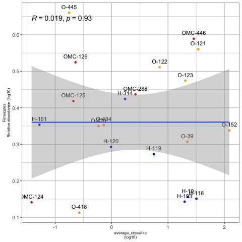

## Correlaciones de Spearman considerando la abundancia relativa de las 27 taxas consideradas como biomarcadores de la obesidad con los promedios (log10) y sumatorias (log10) de crasslike para 23 muestras

### Con el promedio de crasslike

### Con la sumatoria de crasslike

