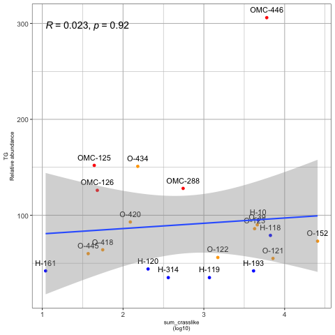

## Correlaciones de Spearman de los parámetros clínicos con los promedios (log10) y sumatorias (log10) de crasslike para 23 muestras

### Con el promedio de crasslike

### Con la sumatoria de crasslike

