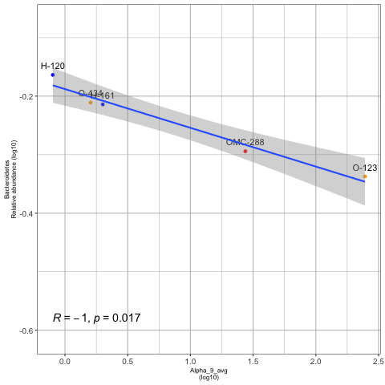
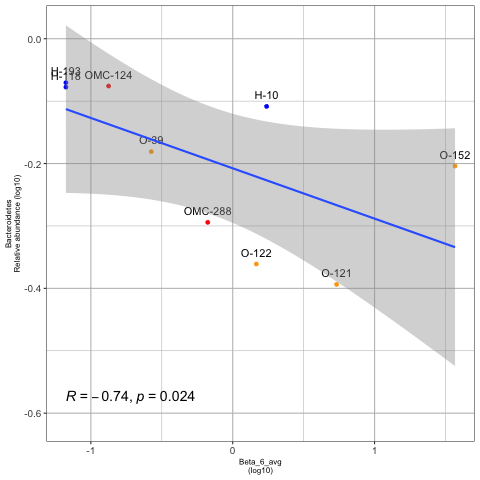
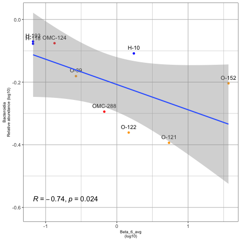
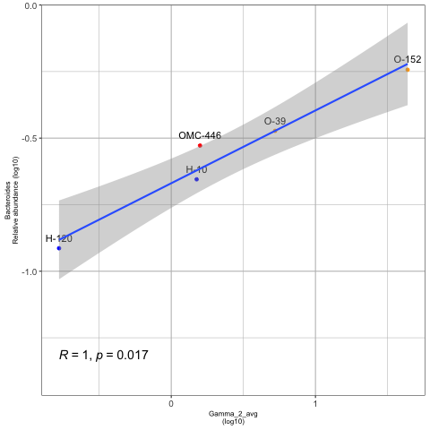
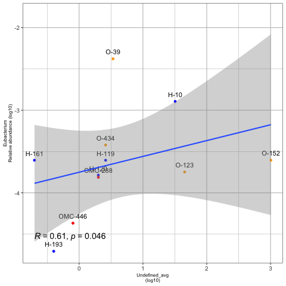

# Correlaciones crAsslike-phages vs host (solo p>0.05)

## Alpha 1

NO HAY

## Alpha 3

NO HAY

## Alpha 4

NO HAY

## Alpha 9

## Beta 6

## Delta 10

NO HAY

## Delta 7

NO HAY

## Delta 8

NO HAY

## Gamma 2

## Undefined

