# Correlaciones crAsslike-phages vs 27 taxa

## Alpha 1

NO HAY

## Alpha 3

NO HAY

## Alpha 4

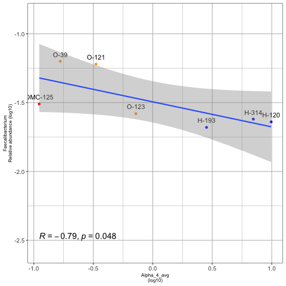

## Alpha 9

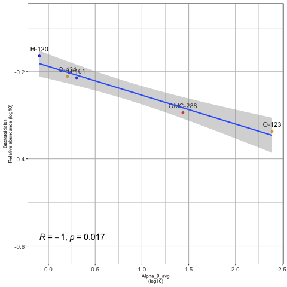

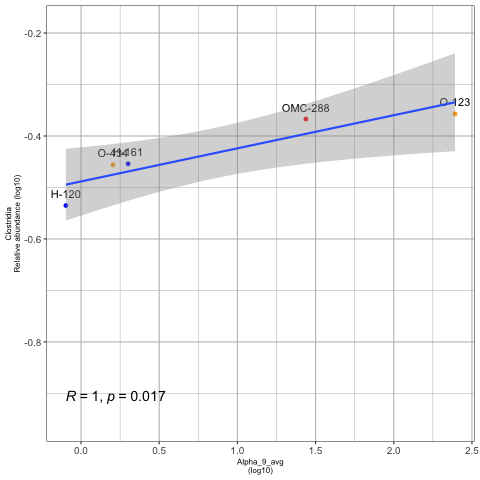

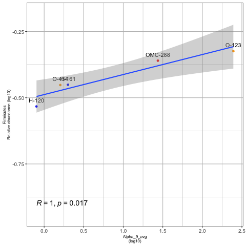

## Beta 6

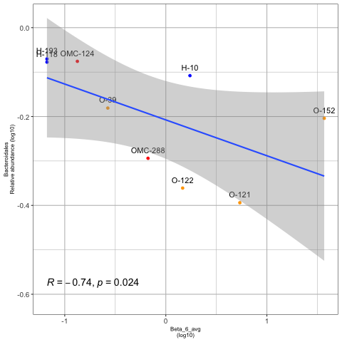

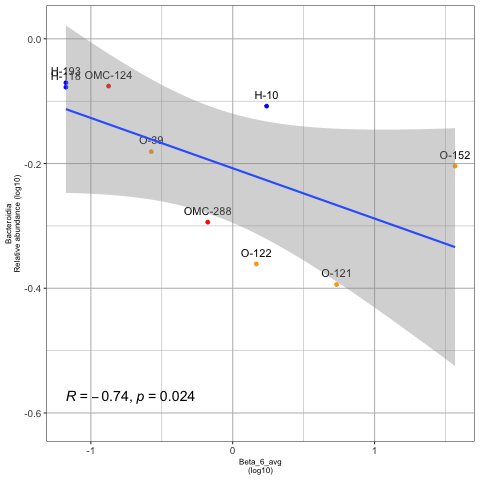

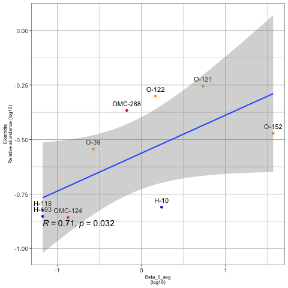

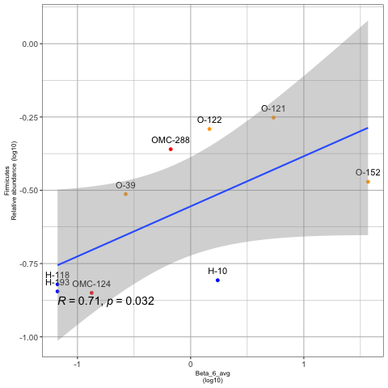

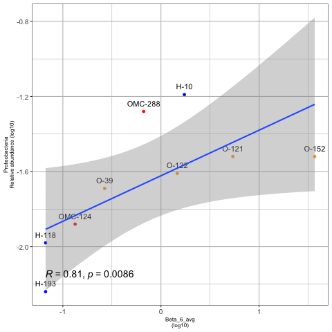

## Delta 10

NO HAY

## Delta 7

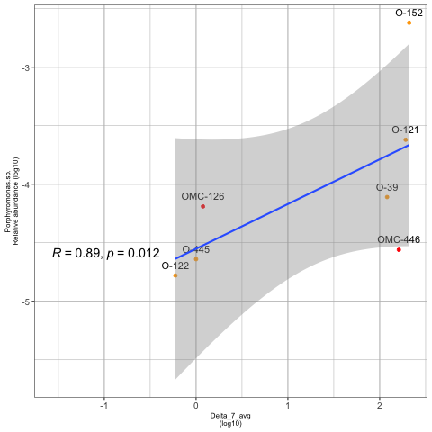

## Delta 8

NO HAY

## Gamma 2

NO HAY

## Undefined

NO SE VE EL P-VALUE, PERO ES 0.048. LO EDITO EN LA FIGURA FINAL

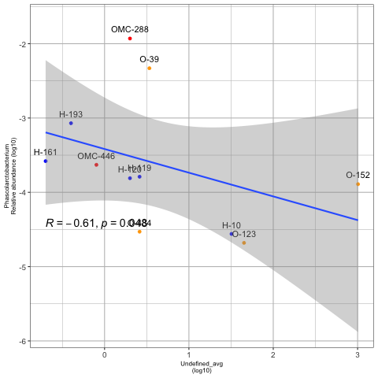

NO SE VE EL P-VALUE, PERO ES 0.048. LO EDITO EN LA FIGURA FINAL

